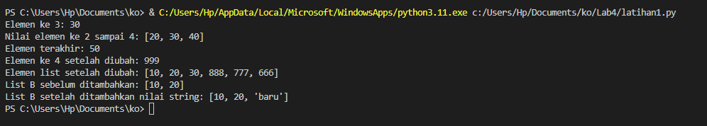

# praktikum 9
* Code ini adalah program sederhana dalam bahasa Python yang memanfaatkan pustaka Tabulate untuk mengumpulkan data nilai mahasiswa dan menampilkan hasilnya dalam bentuk tabel. Program berjalan dalam perulangan dimana pengguna diminta untuk memasukkan data mahasiswa, termasuk nama, NIM (Nomor Induk Mahasiswa), nilai tugas, nilai UTS, dan nilai UAS. Setelah data dimasukkan, nilai akhir dihitung berdasarkan bobot tertentu dan disimpan dalam bentuk dictionary. Pengaturan tata letak tabel, termasuk penataan angka dan teks, diatur menggunakan parameter numalign dan stralign.

# outputnya
](fey11png.png)

# Latihan 1
* print("Elemen ke 3:", A[2]): Menampilkan elemen ke-3 dari list A (indeks dimulai dari 0), yang dalam hal ini adalah nilai 30.
* print("Nilai elemen ke 2 sampai 4:", A[1:4]): Menampilkan nilai elemen ke-2 hingga ke-4 dari list A. Ini menggunakan slicing, sehingga mencetak nilai 20, 30, dan 40.
* print("Elemen terakhir:", A[-1]): Menampilkan elemen terakhir dari list A, yaitu 50.
* A[3] = 999: Mengubah nilai elemen ke-4 dari list A menjadi 999.
* print("Elemen ke 4 setelah diubah:", A[3]): Menampilkan nilai elemen ke-4 setelah diubah, yang sekarang menjadi 999.
* A[3:] = [888, 777, 666]: Mengganti nilai elemen ke-4 dan seterusnya dengan list baru [888, 777, 666].
* print("Elemen list setelah diubah:", A): Menampilkan seluruh list A setelah perubahan, yaitu [10, 20, 30, 888, 777, 666].
* B = A[:2]: Membuat list B yang merupakan salinan dari dua elemen pertama dari list A.
* print("List B sebelum ditambahkan:", B): Menampilkan list B sebelum nilai string "baru" ditambahkan.
* B.append("baru"): Menambahkan nilai string "baru" ke list B.
* print("List B setelah ditambahkan nilai string:", B): Menampilkan list B setelah penambahan nilai string "baru". List B sekarang menjadi [10, 20, 'baru'].

# outputnya
